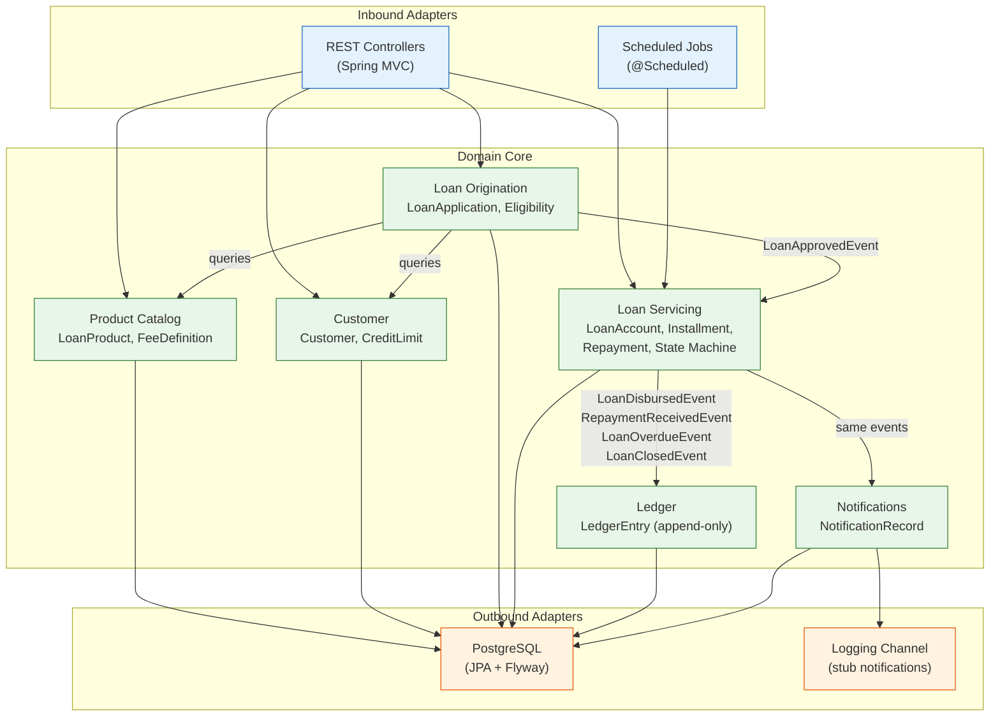

# PA Lending Platform

A simplified lending platform backend built with Spring Boot, demonstrating loan product
configuration, loan lifecycle management, customer management, and event-driven
notifications. Built in the context of **Kenya** (KES currency, Kenyan customer data).

---

## Quickstart

> **Prerequisites:** Java 21 (JDK), Docker (for PostgreSQL)

```bash
# 1. Clone the repository
git clone https://github.com/victororiko/pa-lending-casestudy.git
cd pa-lending-casestudy

# 2. Start PostgreSQL
docker-compose up -d

# 3. Run the application (Flyway migrations + seed data auto-apply)
./gradlew bootRun          # Linux/macOS
gradlew.bat bootRun        # Windows

# 4. Open Swagger UI
open http://localhost:8080/swagger-ui.html

# 5. Run all tests (Docker required for integration/E2E tests via Testcontainers)
./gradlew test
```

The application starts on **port 8080**. Flyway automatically creates all tables and loads
seed data (2 loan products, 3 customers, 1 active demo loan with amortisation schedule).

### Verify it works

```bash
# Health check
curl http://localhost:8080/actuator/health

# List seeded products
curl http://localhost:8080/api/v1/products

# List seeded customers
curl http://localhost:8080/api/v1/customers

# View the demo loan
curl http://localhost:8080/api/v1/loans/e2f3a4b5-c6d7-8901-bcde-f12345678901

# View its amortisation schedule
curl http://localhost:8080/api/v1/loans/e2f3a4b5-c6d7-8901-bcde-f12345678901/schedule
```

### Walk through the full lifecycle via curl

```bash
# 1. Create a product
curl -X POST http://localhost:8080/api/v1/products \
  -H "Content-Type: application/json" \
  -H "Idempotency-Key: $(uuidgen)" \
  -d '{
    "name": "Mkopo wa Haraka",
    "interestRatePerAnnum": "14.00",
    "interestAccrualMethod": "PRE_COMPUTED",
    "minTenureMonths": 1, "maxTenureMonths": 6,
    "minPrincipal": {"amount": "5000.0000", "currency": "KES"},
    "maxPrincipal": {"amount": "100000.0000", "currency": "KES"},
    "repaymentFrequency": "MONTHLY",
    "gracePeriodDays": 3,
    "originationFeeChargeMethod": "DEDUCTED_FROM_DISBURSEMENT",
    "allowEarlyRepayment": true,
    "overpaymentPolicy": "REJECT",
    "feeSchedule": []
  }'

# 2. Create a customer
curl -X POST http://localhost:8080/api/v1/customers \
  -H "Content-Type: application/json" \
  -H "Idempotency-Key: $(uuidgen)" \
  -d '{
    "firstName": "Amina", "lastName": "Hassan",
    "email": "amina.hassan@example.co.ke",
    "phoneNumber": "+254700112233", "nationalId": "33445566",
    "creditLimit": {"amount": "500000.0000", "currency": "KES"},
    "maxActiveLoans": 3
  }'

# 3. Submit a loan application (use the IDs from steps 1 & 2)
curl -X POST http://localhost:8080/api/v1/loans/applications \
  -H "Content-Type: application/json" \
  -H "Idempotency-Key: $(uuidgen)" \
  -d '{"customerId": "<CUSTOMER_ID>", "productId": "<PRODUCT_ID>",
       "requestedPrincipal": {"amount": "50000.0000", "currency": "KES"},
       "requestedTenureMonths": 3}'

# 4. Approve the application
curl -X POST http://localhost:8080/api/v1/loans/applications/<APP_ID>/approve \
  -H "Idempotency-Key: $(uuidgen)"

# 5. Find the loan account via customer's loans
curl http://localhost:8080/api/v1/customers/<CUSTOMER_ID>/loans

# 6. Disburse the loan
curl -X POST http://localhost:8080/api/v1/loans/<LOAN_ID>/disburse \
  -H "Idempotency-Key: $(uuidgen)"

# 7. View the generated schedule
curl http://localhost:8080/api/v1/loans/<LOAN_ID>/schedule

# 8. Record a repayment
curl -X POST http://localhost:8080/api/v1/loans/<LOAN_ID>/repayments \
  -H "Content-Type: application/json" \
  -H "Idempotency-Key: $(uuidgen)" \
  -d '{"amount": {"amount": "17362.4000", "currency": "KES"}}'

# 9. View ledger entries
curl http://localhost:8080/api/v1/loans/<LOAN_ID>/ledger
```

---

## Tech Stack

| Component | Technology |
|-----------|-----------|
| Language | Java 21 |
| Framework | Spring Boot 3.4 |
| Database | PostgreSQL 16 |
| Migrations | Flyway |
| ORM | Spring Data JPA / Hibernate |
| API Docs | springdoc-openapi (Swagger UI) |
| Testing | JUnit 5, Testcontainers, MockMvc |
| Build | Gradle 8.12 (wrapper included) |

---

## Project Structure

```
src/main/java/com/lending/
├── LendingApplication.java
├── shared/                        # Cross-cutting concerns
│   ├── domain/                    #   Money VO, DomainEvent marker
│   ├── adapter/in/web/            #   GlobalExceptionHandler, ErrorResponse
│   ├── adapter/out/persistence/   #   AuditService, AuditLogEntry, BaseEntity
│   ├── infrastructure/            #   IdempotencyFilter, IdempotencyStore, UserContext
│   └── config/                    #   JacksonConfig, ClockConfig, JpaConfig
├── product/                       # Product Catalog bounded context
│   ├── domain/model/              #   LoanProduct, FeeDefinition, enums
│   ├── domain/event/              #   LoanProductCreatedEvent, Updated
│   ├── domain/service/            #   ProductService
│   ├── port/in/                   #   Use case interfaces
│   ├── port/out/                  #   LoanProductRepository port
│   └── adapter/                   #   Controller, JPA entities, mapper
├── customer/                      # Customer bounded context
│   ├── domain/                    #   Customer, events
│   ├── port/out/                  #   CustomerRepository port
│   └── adapter/                   #   Controller, JPA entities, mapper
├── origination/                   # Loan Origination bounded context
│   ├── domain/model/              #   LoanApplication, ApplicationStatus
│   ├── domain/service/            #   LoanApplicationService, EligibilityValidator
│   ├── domain/event/              #   Approved, Rejected, Submitted events
│   └── adapter/                   #   Controller, JPA entities, mapper
├── servicing/                     # Loan Servicing bounded context
│   ├── domain/model/              #   LoanAccount, LoanState, Installment, Repayment
│   ├── domain/service/            #   LoanServicingService, RepaymentAllocationService,
│   │                              #   AmortisationCalculator, OverdueDetectionService
│   ├── domain/event/              #   Disbursed, Repayment, Overdue, Closed events
│   └── adapter/                   #   LoanController, JPA entities, mappers
├── ledger/                        # Ledger bounded context
│   ├── domain/model/              #   LedgerEntry, LedgerEntryType, Direction
│   └── adapter/                   #   LedgerEventListener, JPA persistence
└── notification/                  # Notifications bounded context
    ├── domain/model/              #   NotificationRecord, NotificationChannel
    └── adapter/                   #   NotificationEventListener, LoggingChannel

src/main/resources/
├── application.yml                # Main config (PostgreSQL, Flyway, Jackson, Actuator)
├── application-test.yml           # Test config (Testcontainers JDBC URL)
└── db/migration/
    ├── V001–V010                  # Schema migrations (tables, indexes, constraints)
    └── V900–V902                  # Seed data (products, customers, demo loan)

src/test/java/com/lending/
├── shared/domain/MoneyTest.java
├── servicing/domain/LoanStateTest.java
├── servicing/domain/AmortisationCalculatorTest.java
├── servicing/domain/RepaymentAllocationServiceTest.java
├── origination/domain/EligibilityValidatorTest.java
├── product/adapter/ProductControllerIT.java
├── e2e/LoanLifecycleE2ETest.java
└── e2e/OverdueFlowE2ETest.java
```

---

## API Endpoints

All endpoints use base path `/api/v1`. All `POST`/`PUT`/`PATCH` require an
`Idempotency-Key` header. User identity is read from the `X-User-Id` header (stubbed).

### Products — `/api/v1/products`

| Method | Path | Description |
|--------|------|-------------|
| `POST` | `/products` | Create a loan product |
| `GET` | `/products` | List active products (paginated) |
| `GET` | `/products/{id}` | Get product by ID |
| `PUT` | `/products/{id}` | Update product |
| `DELETE` | `/products/{id}` | Soft-delete product |

### Customers — `/api/v1/customers`

| Method | Path | Description |
|--------|------|-------------|
| `POST` | `/customers` | Create a customer |
| `GET` | `/customers` | List customers (paginated) |
| `GET` | `/customers/{id}` | Get customer by ID |
| `PUT` | `/customers/{id}` | Update customer |
| `GET` | `/customers/{id}/loans` | List customer's loan accounts |

### Loan Applications — `/api/v1/loans/applications`

| Method | Path | Description |
|--------|------|-------------|
| `POST` | `/loans/applications` | Submit a loan application |
| `GET` | `/loans/applications/{id}` | Get application status |
| `POST` | `/loans/applications/{id}/approve` | Approve (runs eligibility check) |
| `POST` | `/loans/applications/{id}/reject` | Reject with reason |

### Loan Accounts — `/api/v1/loans`

| Method | Path | Description |
|--------|------|-------------|
| `GET` | `/loans` | List all loan accounts (paginated) |
| `GET` | `/loans/{id}` | Get loan account details |
| `POST` | `/loans/{id}/disburse` | Disburse the loan |
| `GET` | `/loans/{id}/schedule` | Get amortisation schedule |
| `GET` | `/loans/{id}/ledger` | Get ledger entries |
| `POST` | `/loans/{id}/repayments` | Record a repayment |
| `GET` | `/loans/{id}/repayments` | List repayments |

### Observability

| Path | Description |
|------|-------------|
| `/actuator/health` | Health check |
| `/actuator/metrics` | Metrics |
| `/swagger-ui.html` | Swagger UI |
| `/v3/api-docs` | OpenAPI 3.1 spec |

---

## Seed Data

The application ships with seed data for immediate exploration:

### Products (V900)

| Product | Rate | Tenure | Principal Range (KES) | Key Policy |
|---------|------|--------|----------------------|------------|
| Mkopo wa Muda Mfupi | 14% | 3–12 mo | 10,000–500,000 | Fee deducted from disbursement |
| Mkopo wa Muda Mrefu | 12% | 12–60 mo | 50,000–5,000,000 | Fee added to balance, overpayment applied to next |

### Customers (V901)

| Name | Phone | Credit Limit (KES) | Max Loans |
|------|-------|-------------------|-----------|
| Wanjiku Kamau | +254712345678 | 10,000,000 | 3 |
| Otieno Odhiambo | +254723456789 | 5,000,000 | 2 |
| Aisha Mwangi | +254734567890 | 2,500,000 | 1 |

### Demo Loan (V902)

An active KES 100,000 loan for Wanjiku Kamau with 6 monthly installments already generated.

---

## Running Tests

```bash
# All tests
./gradlew test

# Unit tests only (no Docker needed)
./gradlew test --tests 'com.lending.**.*Test'

# Integration tests only (Docker required for Testcontainers)
./gradlew test --tests 'com.lending.**.*IT'

# E2E tests only (Docker required)
./gradlew test --tests 'com.lending.e2e.*'

# Single test class
./gradlew test --tests 'com.lending.servicing.domain.AmortisationCalculatorTest'
```

Tests are fully self-contained — they do **not** depend on seed data. Unit tests create
domain objects directly; integration and E2E tests create all data via API calls or
repositories.

---

## Architecture Overview

The system follows **hexagonal architecture** (ports and adapters) organised by bounded
context. Cross-context communication uses **in-process domain events** via Spring's
`ApplicationEventPublisher`.



---

## Bounded Contexts

### Product Catalog

Manages loan product templates — the rules under which money can be lent. Products
define interest rates, tenure ranges, fee schedules, repayment frequencies, and five
key business policies that are **configurable per product**:

| Policy | Product Field | Options |
|--------|--------------|--------|
| Interest calculation | `interestAccrualMethod` | `PRE_COMPUTED` (v1), `DAILY_ACCRUAL` (modelled) |
| Grace period | `gracePeriodDays` | 0–N days after due date |
| Origination fee handling | `originationFeeChargeMethod` | `DEDUCTED_FROM_DISBURSEMENT`, `ADDED_TO_BALANCE` |
| Early repayment | `allowEarlyRepayment` + optional `PREPAYMENT_PENALTY` fee | Allow/deny + flat or % penalty |
| Overpayment | `overpaymentPolicy` | `REJECT`, `APPLY_TO_NEXT_INSTALLMENT`, `HOLD_AS_CREDIT` |

This per-product configurability is the primary extensibility lever — new product
variants can be launched without code changes.

### Customer

Manages customer profiles, lending limits, and borrowing capacity. Enforces a `creditLimit`
(hard cap on total outstanding principal) and `maxActiveLoans` per customer.

### Loan Origination

Handles the application-to-approval workflow. Validates requested loan parameters against
product rules and customer eligibility. Snapshots product configuration at approval time
to insulate active loans from future product changes.

### Loan Servicing

The core of the system. Manages the full loan lifecycle via an enum-based state machine:
`PENDING_DISBURSEMENT → ACTIVE → OVERDUE → DEFAULTED → WRITTEN_OFF`, with `CLOSED` as
the terminal success state. Handles disbursement, amortisation schedule generation,
repayment allocation (FIFO, interest before principal), and overdue detection.

### Ledger

An append-only financial journal. Every monetary movement — disbursement, repayment
allocation, fee charge — is recorded as an immutable ledger entry. Serves as the
financial audit trail.

### Notifications

Reacts to domain events and records what communications would be sent. Uses a
`NotificationChannel` interface with a `LoggingNotificationChannel` stub. Designed for
easy extension to real channels (email, SMS, push).

---

## Key Technical Decisions

All architectural decisions are documented as ADRs in [`docs/adr/`](docs/adr/):

| ADR | Decision |
|-----|----------|
| [0001](docs/adr/0001-hexagonal-architecture.md) | Hexagonal (ports & adapters) architecture |
| [0002](docs/adr/0002-postgresql-as-database.md) | PostgreSQL as the database |
| [0003](docs/adr/0003-flyway-for-migrations.md) | Flyway for database migrations |
| [0004](docs/adr/0004-state-machine-for-loan-lifecycle.md) | Hand-rolled enum state machine for loan lifecycle |
| [0005](docs/adr/0005-event-driven-notifications.md) | Event-driven notifications via `ApplicationEventPublisher` |
| [0006](docs/adr/0006-idempotency-strategy.md) | `Idempotency-Key` header on all mutating endpoints |
| [0007](docs/adr/0007-money-representation.md) | `Money` value object wrapping `BigDecimal` + `Currency` |
| [0008](docs/adr/0008-authentication-scope.md) | Authentication stubbed for case study scope |
| [0009](docs/adr/0009-audit-logging-strategy.md) | Three-tier audit logging strategy |
| [0010](docs/adr/0010-testing-strategy.md) | Test pyramid: unit → integration → E2E |

---

## How to Extend

### Add a new notification channel (e.g., SMS)

1. Implement the `NotificationChannel` interface:
   ```java
   @Component
   public class SmsNotificationChannel implements NotificationChannel {
       @Override
       public void send(NotificationRecord record) {
           // Call Twilio API
       }

       @Override
       public boolean supports(String channel) {
           return "SMS".equals(channel);
       }
   }
   ```
2. Register it as a Spring bean (it already is, via `@Component`).
3. The `NotificationDispatcher` auto-discovers all `NotificationChannel` beans and
   routes by channel type. No changes to existing code.

### Add a new fee type

1. Add the new value to the `FeeType` enum (e.g., `PREPAYMENT_PENALTY`).
2. Implement calculation logic in the fee strategy.
3. Add the fee type to `FeeDefinition` in the product configuration.
4. The repayment or payoff flow picks up the fee automatically.

### Add a new loan state

1. Add the new value to the `LoanState` enum.
2. Add valid transitions to/from the new state in the `VALID_TRANSITIONS` map.
3. Publish a new domain event for the transition.
4. Add event listeners in Ledger and Notification contexts.

---

## Documentation

| Document | Purpose |
|----------|---------|
| [01 — Assumptions & Scope](docs/01-assumptions-and-scope.md) | Business rules, scope boundaries, glossary |
| [02 — Domain Model](docs/02-domain-model.md) | Bounded contexts, aggregates, state machine, events |
| [03 — API & Schema](docs/03-api-and-schema.md) | REST endpoints, ERD, sequence diagrams |
| [04 — Project Plan](docs/04-project-plan.md) | Repository structure, task breakdown, commit conventions |
| [05 — Testing Strategy](docs/05-testing-strategy.md) | Test pyramid, painful edge cases, execution instructions |
| [06 — Trade-Offs](docs/06-trade-offs.md) | What's stubbed, what comes next, known limitations |
| [OpenAPI Spec](docs/openapi.yaml) | Skeleton OpenAPI 3.1 specification |

---

## Trade-Offs & Known Limitations

See [docs/06-trade-offs.md](docs/06-trade-offs.md) for a candid discussion of what's
deliberately simplified, what would be built next, and what would change for real
production deployment.
