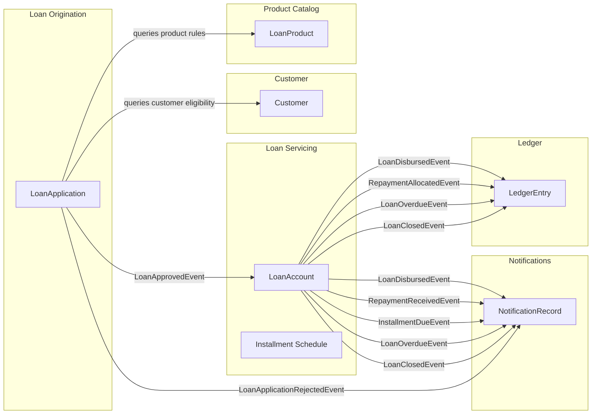
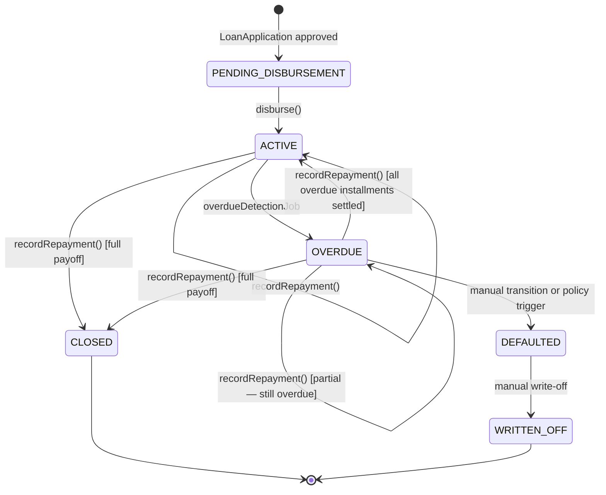

# 02 — Domain Model

> This document defines the bounded contexts, aggregates, entities, value objects,
> invariants, and domain events for the lending platform. All terminology follows the
> [Glossary](01-assumptions-and-scope.md#5-glossary-of-domain-terms).

---

## 1. Bounded Contexts

The system is decomposed into six bounded contexts. Each context owns its data and
exposes behaviour through well-defined interfaces (ports). Cross-context communication
is event-driven where possible, falling back to synchronous queries only for reads that
must be strongly consistent.

| Context | Responsibility | Key Aggregate |
|---------|---------------|---------------|
| **Product Catalog** | Define and manage loan product templates | `LoanProduct` |
| **Customer** | Manage customer profiles and lending limits | `Customer` |
| **Loan Origination** | Accept applications, validate eligibility, approve/reject | `LoanApplication` |
| **Loan Servicing** | Manage active loans — repayments, schedule tracking, state transitions, overdue detection | `LoanAccount` |
| **Ledger** | Append-only financial journal of all monetary movements | `LedgerEntry` (no aggregate root — pure event-sourced log) |
| **Notifications** | React to domain events and dispatch communication stubs | `NotificationRecord` |

### 1.1 Context Map



**Communication patterns:**

- **Product Catalog → Origination:** Synchronous query. Origination needs product rules
  to validate an application. The product is read-only from Origination's perspective.
- **Customer → Origination:** Synchronous query. Origination checks credit limit and
  active-loan count before approving.
- **Origination → Servicing:** `LoanApprovedEvent`. When an application is approved and
  disbursement is triggered, Servicing creates the `LoanAccount` and generates the
  amortisation schedule.
- **Servicing → Ledger:** Events (`LoanDisbursedEvent`, `RepaymentAllocatedEvent`,
  etc.). The Ledger context listens and appends entries. This is a downstream,
  eventually consistent consumer. See [ADR-0005](adr/0005-event-driven-notifications.md).
- **Servicing → Notifications:** Same event bus. Notifications is a separate listener
  that reacts to lifecycle events.

---

## 2. Detailed Context Models

### 2.1 Product Catalog

#### Aggregate Root: `LoanProduct`

| Field | Type | Constraints |
|-------|------|-------------|
| `id` | `UUID` | PK, immutable |
| `name` | `String` | Unique, non-blank, max 100 chars |
| `description` | `String` | Optional, max 500 chars |
| `interestRatePerAnnum` | `BigDecimal` | > 0, ≤ 100 (percentage) |
| `interestAccrualMethod` | `InterestAccrualMethod` enum | `PRE_COMPUTED`, `DAILY_ACCRUAL`. Default `PRE_COMPUTED`. See [assumption A1](01-assumptions-and-scope.md). |
| `minTenureMonths` | `int` | ≥ 1 |
| `maxTenureMonths` | `int` | ≥ `minTenureMonths` |
| `minPrincipal` | `Money` | > 0 |
| `maxPrincipal` | `Money` | ≥ `minPrincipal` |
| `repaymentFrequency` | `RepaymentFrequency` enum | `MONTHLY`, `BI_WEEKLY`, `WEEKLY` |
| `gracePeriodDays` | `int` | ≥ 0, default 0. Days after due date before overdue classification. See [assumption A2](01-assumptions-and-scope.md). |
| `originationFeeChargeMethod` | `OriginationFeeChargeMethod` enum | `DEDUCTED_FROM_DISBURSEMENT`, `ADDED_TO_BALANCE`. Default `DEDUCTED_FROM_DISBURSEMENT`. See [assumption A9](01-assumptions-and-scope.md). |
| `allowEarlyRepayment` | `boolean` | Default `true`. If `false`, payoff before final installment is rejected. See [assumption A8](01-assumptions-and-scope.md). |
| `overpaymentPolicy` | `OverpaymentPolicy` enum | `REJECT`, `APPLY_TO_NEXT_INSTALLMENT`, `HOLD_AS_CREDIT`. Default `REJECT`. See [assumption A7](01-assumptions-and-scope.md). |
| `feeSchedule` | `List<FeeDefinition>` | Value object collection |
| `active` | `boolean` | Soft-disable without deletion |
| `deletedAt` | `Instant?` | Null = not deleted |
| `createdAt` | `Instant` | Immutable |
| `updatedAt` | `Instant` | Auto-maintained |
| `version` | `long` | Optimistic lock |

#### Value Object: `FeeDefinition`

| Field | Type |
|-------|------|
| `feeType` | `FeeType` enum (`ORIGINATION_FEE`, `LATE_PAYMENT_FEE`, `PREPAYMENT_PENALTY`) |
| `calculationMethod` | `FeeCalculationMethod` enum (`FLAT`, `PERCENTAGE_OF_PRINCIPAL`, `PERCENTAGE_OF_OUTSTANDING`) |
| `amount` | `Money` | Flat amount or percentage value |

> `PERCENTAGE_OF_OUTSTANDING` is valid only for `PREPAYMENT_PENALTY`. Validation rejects
> other combinations (e.g., origination fee as percentage of outstanding).

#### Invariants

1. `maxTenureMonths ≥ minTenureMonths`
2. `maxPrincipal ≥ minPrincipal`
3. A product must have at most one fee of each `FeeType`.
4. A deactivated or deleted product cannot be used for new loan applications.
5. `gracePeriodDays ≥ 0`.
6. If `allowEarlyRepayment` is `false`, the fee schedule must not contain a `PREPAYMENT_PENALTY` (contradiction: can’t penalise something that’s forbidden).
7. `PREPAYMENT_PENALTY` fee may only use `FLAT` or `PERCENTAGE_OF_OUTSTANDING` calculation methods.
8. If `interestAccrualMethod` is `DAILY_ACCRUAL`, the system validates the product but rejects disbursement in v1 with `501 Not Implemented`.

#### Domain Events Emitted

- `LoanProductCreatedEvent`
- `LoanProductUpdatedEvent`

---

### 2.2 Customer

#### Aggregate Root: `Customer`

| Field | Type | Constraints |
|-------|------|-------------|
| `id` | `UUID` | PK, immutable |
| `firstName` | `String` | Non-blank, max 100 |
| `lastName` | `String` | Non-blank, max 100 |
| `email` | `String` | Valid email, unique |
| `phoneNumber` | `String` | E.164 format, unique |
| `nationalId` | `String` | Unique (stub for KYC) |
| `creditLimit` | `Money` | ≥ 0 |
| `maxActiveLoans` | `int` | ≥ 1, default 3 |
| `deletedAt` | `Instant?` | Null = not deleted |
| `createdAt` | `Instant` | Immutable |
| `updatedAt` | `Instant` | Auto-maintained |
| `version` | `long` | Optimistic lock |

#### Invariants

1. `email` must be unique across non-deleted customers.
2. `creditLimit ≥ 0`. A zero limit means the customer is frozen from borrowing.
3. `maxActiveLoans ≥ 1`.
4. A deleted customer cannot apply for new loans. Existing active loans continue to be serviced.

#### Domain Events Emitted

- `CustomerCreatedEvent`
- `CustomerUpdatedEvent`

---

### 2.3 Loan Origination

#### Aggregate Root: `LoanApplication`

| Field | Type | Constraints |
|-------|------|-------------|
| `id` | `UUID` | PK, immutable |
| `customerId` | `UUID` | FK → Customer |
| `productId` | `UUID` | FK → LoanProduct |
| `requestedPrincipal` | `Money` | Must be within product's min/max |
| `requestedTenureMonths` | `int` | Must be within product's min/max |
| `status` | `ApplicationStatus` enum | `PENDING` → `APPROVED` / `REJECTED` |
| `rejectionReason` | `String?` | Populated on rejection |
| `approvedAt` | `Instant?` | Set on approval |
| `snapshotInterestRate` | `BigDecimal?` | Captured from product at approval time |
| `snapshotFeeSchedule` | `List<FeeDefinition>?` | Captured from product at approval time |
| `createdAt` | `Instant` | Immutable |
| `updatedAt` | `Instant` | Auto-maintained |
| `version` | `long` | Optimistic lock |

#### Eligibility Rules (applied during approval)

1. Product must be active and not deleted.
2. Customer must not be deleted.
3. `requestedPrincipal` within `[product.minPrincipal, product.maxPrincipal]`.
4. `requestedTenureMonths` within `[product.minTenureMonths, product.maxTenureMonths]`.
5. Customer's current outstanding principal + requested principal ≤ `customer.creditLimit`.
6. Customer's active loan count < `customer.maxActiveLoans`.

If any rule fails, the application is `REJECTED` with a descriptive `rejectionReason`.

#### Domain Events Emitted

- `LoanApplicationSubmittedEvent`
- `LoanApplicationApprovedEvent` — triggers `LoanAccount` creation in Servicing
- `LoanApplicationRejectedEvent`

---

### 2.4 Loan Servicing

#### Aggregate Root: `LoanAccount`

| Field | Type | Constraints |
|-------|------|-------------|
| `id` | `UUID` | PK, immutable |
| `applicationId` | `UUID` | FK → LoanApplication, unique |
| `customerId` | `UUID` | FK → Customer |
| `productId` | `UUID` | FK → LoanProduct (for reference) |
| `principal` | `Money` | Snapshotted from application |
| `interestRatePerAnnum` | `BigDecimal` | Snapshotted from product at approval |
| `interestAccrualMethod` | `InterestAccrualMethod` | Snapshotted from product |
| `tenureMonths` | `int` | Snapshotted from application |
| `repaymentFrequency` | `RepaymentFrequency` | Snapshotted from product |
| `gracePeriodDays` | `int` | Snapshotted from product |
| `originationFeeChargeMethod` | `OriginationFeeChargeMethod` | Snapshotted from product |
| `allowEarlyRepayment` | `boolean` | Snapshotted from product |
| `overpaymentPolicy` | `OverpaymentPolicy` | Snapshotted from product |
| `originationFee` | `Money` | Computed at creation |
| `totalDisbursed` | `Money` | `principal - originationFee` (if `DEDUCTED_FROM_DISBURSEMENT`) or `principal` (if `ADDED_TO_BALANCE`) |
| `outstandingBalance` | `Money` | Maintained: decremented on repayment |
| `creditBalance` | `Money` | Default `0`. Holds overpayment surplus under `HOLD_AS_CREDIT` policy. See [assumption A7](01-assumptions-and-scope.md). |
| `state` | `LoanState` enum | See state machine below |
| `disbursedAt` | `Instant?` | |
| `closedAt` | `Instant?` | |
| `createdAt` | `Instant` | Immutable |
| `updatedAt` | `Instant` | |
| `version` | `long` | Optimistic lock |

#### Loan State Machine



**Valid transitions (enforced by enum-based state machine):**

| From | To | Trigger |
|------|----|---------|
| `PENDING_DISBURSEMENT` | `ACTIVE` | `disburse()` |
| `ACTIVE` | `OVERDUE` | Overdue detection job finds past-due installment |
| `ACTIVE` | `CLOSED` | Final repayment settles all installments |
| `OVERDUE` | `ACTIVE` | Repayment clears all overdue installments |
| `OVERDUE` | `CLOSED` | Full payoff |
| `OVERDUE` | `DEFAULTED` | Manual/policy decision (not automated in v1) |
| `DEFAULTED` | `WRITTEN_OFF` | Manual write-off |

Any transition not in this table throws `IllegalLoanStateTransitionException`.

See [ADR-0004](adr/0004-state-machine-for-loan-lifecycle.md) for why a hand-rolled
enum-based machine was chosen over Spring Statemachine or a workflow engine.

#### Entity: `Installment` (child of `LoanAccount`)

| Field | Type | Constraints |
|-------|------|-------------|
| `id` | `UUID` | PK |
| `loanAccountId` | `UUID` | FK → LoanAccount |
| `installmentNumber` | `int` | 1-indexed |
| `dueDate` | `LocalDate` | |
| `principalDue` | `Money` | |
| `interestDue` | `Money` | |
| `totalDue` | `Money` | `principalDue + interestDue` |
| `principalPaid` | `Money` | Accumulated from repayments |
| `interestPaid` | `Money` | Accumulated from repayments |
| `totalPaid` | `Money` | |
| `status` | `InstallmentStatus` enum | `PENDING`, `PARTIALLY_PAID`, `PAID`, `OVERDUE` |

#### Entity: `Repayment` (child of `LoanAccount`)

| Field | Type | Constraints |
|-------|------|-------------|
| `id` | `UUID` | PK |
| `loanAccountId` | `UUID` | FK → LoanAccount |
| `amount` | `Money` | > 0 |
| `receivedAt` | `Instant` | |
| `idempotencyKey` | `String` | Unique |
| `createdAt` | `Instant` | |

#### Invariants

1. `outstandingBalance` must equal `sum(installment.totalDue - installment.totalPaid)` at all times (adjusted for credit balance under `HOLD_AS_CREDIT` policy).
2. A repayment cannot exceed `outstandingBalance` unless `overpaymentPolicy` is `APPLY_TO_NEXT_INSTALLMENT` or `HOLD_AS_CREDIT`. Under `REJECT`, the repayment is rejected. Under `APPLY_TO_NEXT_INSTALLMENT`, surplus is allocated forward. Under `HOLD_AS_CREDIT`, surplus is stored in `creditBalance`.
3. State transitions must follow the state machine. No skipping states.
4. Repayments can only be recorded on loans in `ACTIVE` or `OVERDUE` state.
5. Disbursement can only occur on loans in `PENDING_DISBURSEMENT` state.
6. A `CLOSED` loan is immutable — no further repayments or state changes.
7. Early payoff (repayment that settles all installments before the last due date) is rejected if `allowEarlyRepayment` is `false`.
8. If `allowEarlyRepayment` is `true` and the fee schedule contains a `PREPAYMENT_PENALTY`, the penalty is computed and added to the payoff amount.
9. The overdue detection job uses `dueDate + gracePeriodDays` when determining if an installment is overdue.

#### Domain Events Emitted

- `LoanDisbursedEvent` — after successful disbursement
- `RepaymentReceivedEvent` — when a repayment is recorded
- `RepaymentAllocatedEvent` — per-installment allocation details (for Ledger)
- `InstallmentPaidEvent` — when an installment is fully paid
- `LoanOverdueEvent` — when the overdue job transitions a loan
- `LoanClosedEvent` — when all installments are paid
- `LoanDefaultedEvent` — on manual default
- `LoanWrittenOffEvent` — on manual write-off

---

### 2.5 Ledger

The Ledger context has no aggregate root in the traditional sense. It is an **append-only
journal** that listens to domain events from Loan Servicing and creates entries.

#### Entity: `LedgerEntry`

| Field | Type | Constraints |
|-------|------|-------------|
| `id` | `UUID` | PK |
| `loanAccountId` | `UUID` | FK → LoanAccount |
| `entryType` | `LedgerEntryType` enum | `DISBURSEMENT`, `REPAYMENT_PRINCIPAL`, `REPAYMENT_INTEREST`, `FEE_CHARGE`, `FEE_PAYMENT`, `WRITE_OFF` |
| `amount` | `Money` | |
| `direction` | `Direction` enum | `DEBIT` (money out to customer), `CREDIT` (money in from customer) |
| `description` | `String` | Human-readable |
| `referenceId` | `UUID?` | Points to Repayment or Fee source |
| `createdAt` | `Instant` | Immutable |

#### Invariants

1. Ledger entries are **append-only**. No updates, no deletes.
2. For any `LoanAccount`, `sum(CREDIT entries) - sum(DEBIT entries)` must equal the amount repaid.
3. Every monetary event in the system MUST have a corresponding ledger entry.

---

### 2.6 Notifications

The Notifications context listens to domain events and records what communications
*would* be sent. The actual delivery is stubbed via a `LoggingNotificationChannel`.

#### Entity: `NotificationRecord`

| Field | Type | Constraints |
|-------|------|-------------|
| `id` | `UUID` | PK |
| `customerId` | `UUID` | FK → Customer |
| `loanAccountId` | `UUID?` | FK → LoanAccount (nullable for non-loan notifications) |
| `channel` | `NotificationChannel` enum | `EMAIL`, `SMS`, `IN_APP` (extensible) |
| `eventType` | `String` | e.g., `LOAN_DISBURSED`, `PAYMENT_DUE`, `LOAN_OVERDUE` |
| `templateKey` | `String` | Reference to a notification template |
| `payload` | `JSON (text)` | Serialised context for the template |
| `status` | `NotificationStatus` enum | `PENDING`, `SENT`, `FAILED` (stub always sets `SENT`) |
| `createdAt` | `Instant` | |

#### Domain Events Consumed

| Event | Notification Triggered |
|-------|----------------------|
| `LoanDisbursedEvent` | "Your loan has been disbursed" |
| `RepaymentReceivedEvent` | "Payment received — thank you" |
| `InstallmentDueEvent` (generated by scheduled reminder job) | "Your payment of X is due on Y" |
| `LoanOverdueEvent` | "Your loan is overdue — please pay immediately" |
| `LoanClosedEvent` | "Congratulations — your loan is fully repaid" |
| `LoanApplicationRejectedEvent` | "Your loan application was not approved" |

See [ADR-0005](adr/0005-event-driven-notifications.md) for the event-driven design rationale.

---

## 3. The `Money` Value Object

All monetary values across every bounded context use the `Money` value object.
**Primitives (`double`, `float`, raw `BigDecimal`) are never passed across method
boundaries for monetary values.**

```
Money {
    amount: BigDecimal    // scale = 4, rounding = HALF_EVEN
    currency: Currency    // java.util.Currency, default USD
}
```

### Why not raw `BigDecimal`?

| Problem with raw `BigDecimal` | How `Money` solves it |
|-------------------------------|----------------------|
| No currency context — easy to add USD to EUR | `Money.add(Money)` asserts same currency |
| No enforced scale — `new BigDecimal("10")` has scale 0 | Constructor normalises to scale 4 |
| No enforced rounding — division without rounding mode throws | All arithmetic uses `HALF_EVEN` (banker's rounding) |
| Serialisation inconsistencies | Custom Jackson serialiser/deserialiser guarantees `{"amount": "1234.5600", "currency": "USD"}` |
| Database mapping ambiguity | JPA `AttributeConverter` maps to `NUMERIC(19,4)` + `VARCHAR(3)` |

See [ADR-0007](adr/0007-money-representation.md) for the full decision record.

---

## 4. Cross-Cutting Concerns

### 4.1 Audit Log

An `audit_log` table captures before/after snapshots of entity state changes:

| Field | Type |
|-------|------|
| `id` | `UUID` |
| `entityType` | `String` |
| `entityId` | `UUID` |
| `action` | `String` (`CREATE`, `UPDATE`, `DELETE`) |
| `beforeSnapshot` | `JSON (text)?` |
| `afterSnapshot` | `JSON (text)` |
| `performedBy` | `String` |
| `performedAt` | `Instant` |

See [ADR-0009](adr/0009-audit-logging-strategy.md).

### 4.2 Idempotency Store

| Field | Type |
|-------|------|
| `idempotencyKey` | `String` (PK) |
| `httpMethod` | `String` |
| `requestPath` | `String` |
| `responseStatus` | `int` |
| `responseBody` | `text` |
| `createdAt` | `Instant` |
| `expiresAt` | `Instant` |

See [ADR-0006](adr/0006-idempotency-strategy.md).

---

**Feeds into next document:** The bounded contexts, aggregate structures, state machine,
and event catalog defined here drive the ADR justifications (especially ADR-0001, 0004,
0005, 0007) and the API + schema design in [03-api-and-schema.md](03-api-and-schema.md).
