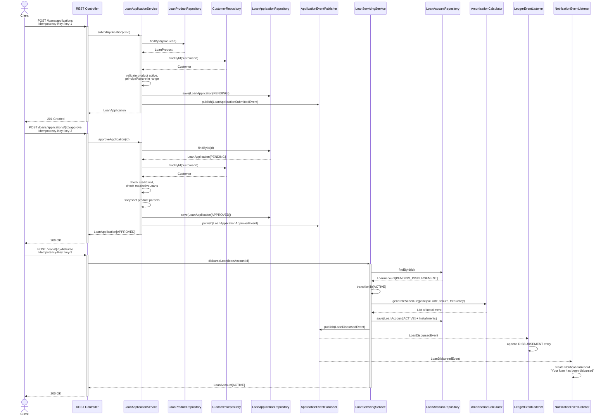
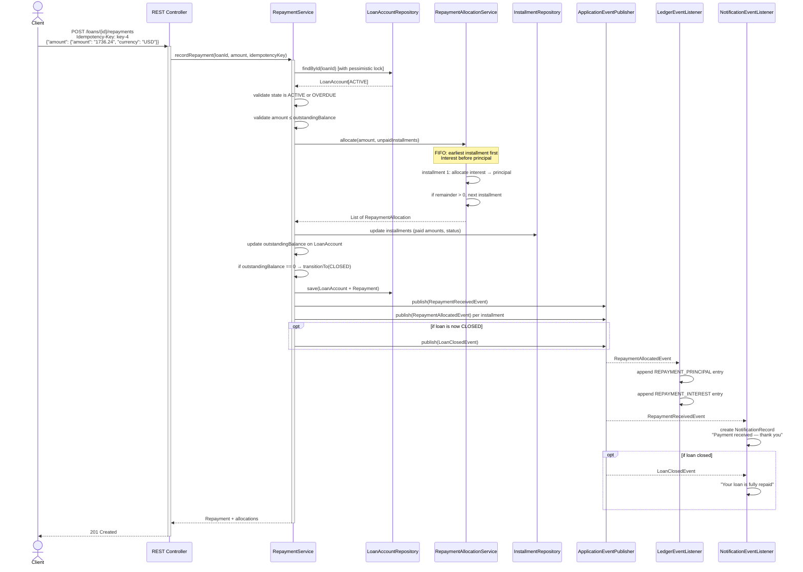
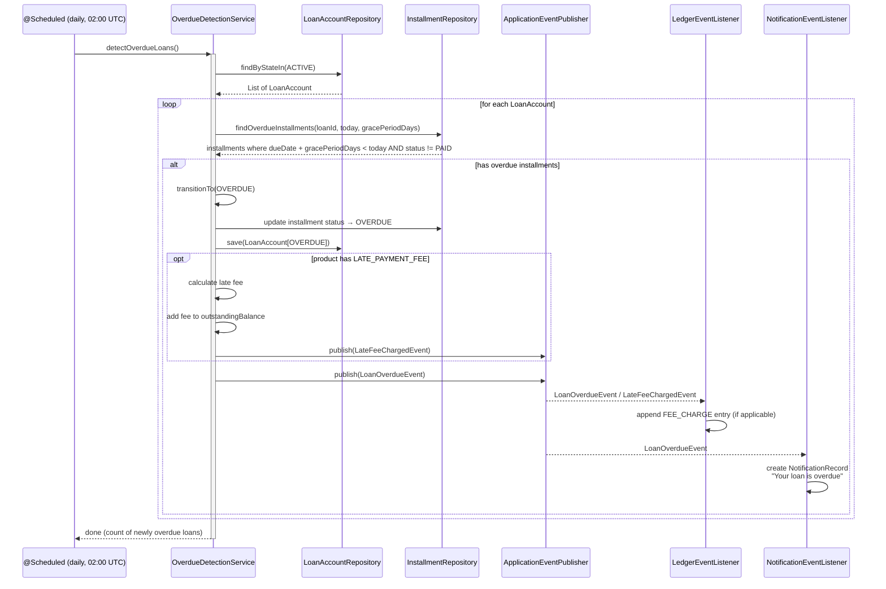

# 03 — API Design and Database Schema

> This document defines the REST API surface, the database ERD, and sequence diagrams
> for the three critical flows. All terminology follows the
> [Glossary](01-assumptions-and-scope.md#5-glossary-of-domain-terms). Domain model
> details are in [02-domain-model.md](02-domain-model.md).

---

## 1. REST API Design

### Conventions

- **Base path:** `/api/v1`
- **Content type:** `application/json` for all request and response bodies.
- **Idempotency:** All `POST`, `PUT`, `PATCH` endpoints require an `Idempotency-Key`
  header (see [ADR-0006](adr/0006-idempotency-strategy.md)).
- **User identification:** `X-User-Id` header (stub — see [ADR-0008](adr/0008-authentication-scope.md)).
- **Pagination:** List endpoints support `?page=0&size=20&sort=createdAt,desc`.
- **Error shape:** All errors use a consistent JSON envelope:
  ```json
  {
    "timestamp": "2026-04-28T12:00:00Z",
    "status": 400,
    "error": "Bad Request",
    "code": "VALIDATION_ERROR",
    "message": "Human-readable message",
    "details": [
      { "field": "requestedPrincipal.amount", "message": "must be greater than 0" }
    ],
    "path": "/api/v1/loans",
    "traceId": "abc-123"
  }
  ```

---

### 1.1 Loan Products — `/api/v1/products`

| Method | Path | Description | Idempotent | Success | Key Errors |
|--------|------|-------------|------------|---------|------------|
| `POST` | `/products` | Create a loan product | Via header | `201 Created` | `400` validation, `409` duplicate name |
| `GET` | `/products` | List active products (paginated) | N/A (GET) | `200 OK` | — |
| `GET` | `/products/{id}` | Get product by ID | N/A | `200 OK` | `404` not found |
| `PUT` | `/products/{id}` | Update product | Via header | `200 OK` | `404`, `400`, `409 Conflict` (optimistic lock) |
| `DELETE` | `/products/{id}` | Soft-delete product | Via header | `204 No Content` | `404` |

**Request — Create / Update Product:**
```json
{
  "name": "Short-Term Consumer Loan",
  "description": "6-month consumer loan with flat origination fee",
  "interestRatePerAnnum": "12.50",
  "interestAccrualMethod": "PRE_COMPUTED",
  "minTenureMonths": 3,
  "maxTenureMonths": 12,
  "minPrincipal": { "amount": "1000.0000", "currency": "USD" },
  "maxPrincipal": { "amount": "50000.0000", "currency": "USD" },
  "repaymentFrequency": "MONTHLY",
  "gracePeriodDays": 3,
  "originationFeeChargeMethod": "DEDUCTED_FROM_DISBURSEMENT",
  "allowEarlyRepayment": true,
  "overpaymentPolicy": "REJECT",
  "feeSchedule": [
    {
      "feeType": "ORIGINATION_FEE",
      "calculationMethod": "PERCENTAGE_OF_PRINCIPAL",
      "amount": { "amount": "2.0000", "currency": "USD" }
    },
    {
      "feeType": "LATE_PAYMENT_FEE",
      "calculationMethod": "FLAT",
      "amount": { "amount": "25.0000", "currency": "USD" }
    },
    {
      "feeType": "PREPAYMENT_PENALTY",
      "calculationMethod": "PERCENTAGE_OF_OUTSTANDING",
      "amount": { "amount": "2.0000", "currency": "USD" }
    }
  ]
}
```

**Response — Product:**
```json
{
  "id": "a1b2c3d4-...",
  "name": "Short-Term Consumer Loan",
  "description": "6-month consumer loan with flat origination fee",
  "interestRatePerAnnum": "12.50",
  "interestAccrualMethod": "PRE_COMPUTED",
  "minTenureMonths": 3,
  "maxTenureMonths": 12,
  "minPrincipal": { "amount": "1000.0000", "currency": "USD" },
  "maxPrincipal": { "amount": "50000.0000", "currency": "USD" },
  "repaymentFrequency": "MONTHLY",
  "gracePeriodDays": 3,
  "originationFeeChargeMethod": "DEDUCTED_FROM_DISBURSEMENT",
  "allowEarlyRepayment": true,
  "overpaymentPolicy": "REJECT",
  "feeSchedule": [ ... ],
  "active": true,
  "createdAt": "2026-04-28T10:00:00Z",
  "updatedAt": "2026-04-28T10:00:00Z",
  "version": 0
}
```

---

### 1.2 Customers — `/api/v1/customers`

| Method | Path | Description | Idempotent | Success | Key Errors |
|--------|------|-------------|------------|---------|------------|
| `POST` | `/customers` | Create a customer | Via header | `201 Created` | `400`, `409` duplicate email/phone/nationalId |
| `GET` | `/customers` | List customers (paginated) | N/A | `200 OK` | — |
| `GET` | `/customers/{id}` | Get customer by ID | N/A | `200 OK` | `404` |
| `PUT` | `/customers/{id}` | Update customer profile | Via header | `200 OK` | `404`, `400`, `409` |
| `GET` | `/customers/{id}/loans` | List customer's loan accounts | N/A | `200 OK` | `404` (customer) |

**Request — Create Customer:**
```json
{
  "firstName": "Jane",
  "lastName": "Doe",
  "email": "jane.doe@example.com",
  "phoneNumber": "+12025551234",
  "nationalId": "ID-12345678",
  "creditLimit": { "amount": "100000.0000", "currency": "USD" },
  "maxActiveLoans": 3
}
```

**Response — Customer:**
```json
{
  "id": "b2c3d4e5-...",
  "firstName": "Jane",
  "lastName": "Doe",
  "email": "jane.doe@example.com",
  "phoneNumber": "+12025551234",
  "nationalId": "ID-12345678",
  "creditLimit": { "amount": "100000.0000", "currency": "USD" },
  "maxActiveLoans": 3,
  "createdAt": "2026-04-28T10:00:00Z",
  "updatedAt": "2026-04-28T10:00:00Z",
  "version": 0
}
```

---

### 1.3 Loan Applications — `/api/v1/loans/applications`

| Method | Path | Description | Idempotent | Success | Key Errors |
|--------|------|-------------|------------|---------|------------|
| `POST` | `/loans/applications` | Submit a loan application | Via header | `201 Created` | `400`, `404` (customer/product) |
| `GET` | `/loans/applications/{id}` | Get application status | N/A | `200 OK` | `404` |
| `POST` | `/loans/applications/{id}/approve` | Approve the application | Via header | `200 OK` | `404`, `409` (not PENDING), `422` (eligibility) |
| `POST` | `/loans/applications/{id}/reject` | Reject the application | Via header | `200 OK` | `404`, `409` (not PENDING) |

**Request — Submit Application:**
```json
{
  "customerId": "b2c3d4e5-...",
  "productId": "a1b2c3d4-...",
  "requestedPrincipal": { "amount": "10000.0000", "currency": "USD" },
  "requestedTenureMonths": 6
}
```

**Response — Application:**
```json
{
  "id": "c3d4e5f6-...",
  "customerId": "b2c3d4e5-...",
  "productId": "a1b2c3d4-...",
  "requestedPrincipal": { "amount": "10000.0000", "currency": "USD" },
  "requestedTenureMonths": 6,
  "status": "PENDING",
  "rejectionReason": null,
  "createdAt": "2026-04-28T10:05:00Z",
  "updatedAt": "2026-04-28T10:05:00Z",
  "version": 0
}
```

**Request — Reject (body):**
```json
{
  "reason": "Insufficient credit history"
}
```

---

### 1.4 Loan Accounts — `/api/v1/loans`

| Method | Path | Description | Idempotent | Success | Key Errors |
|--------|------|-------------|------------|---------|------------|
| `GET` | `/loans` | List loan accounts (paginated, filterable by state/customer) | N/A | `200 OK` | — |
| `GET` | `/loans/{id}` | Get loan account details (includes schedule summary) | N/A | `200 OK` | `404` |
| `POST` | `/loans/{id}/disburse` | Disburse the loan | Via header | `200 OK` | `404`, `409` (not PENDING_DISBURSEMENT) |
| `GET` | `/loans/{id}/schedule` | Get full amortisation schedule | N/A | `200 OK` | `404` |
| `GET` | `/loans/{id}/ledger` | Get ledger entries for this loan | N/A | `200 OK` | `404` |

**Response — Loan Account:**
```json
{
  "id": "d4e5f6g7-...",
  "applicationId": "c3d4e5f6-...",
  "customerId": "b2c3d4e5-...",
  "productId": "a1b2c3d4-...",
  "principal": { "amount": "10000.0000", "currency": "USD" },
  "interestRatePerAnnum": "12.50",
  "interestAccrualMethod": "PRE_COMPUTED",
  "tenureMonths": 6,
  "repaymentFrequency": "MONTHLY",
  "gracePeriodDays": 3,
  "originationFeeChargeMethod": "DEDUCTED_FROM_DISBURSEMENT",
  "allowEarlyRepayment": true,
  "overpaymentPolicy": "REJECT",
  "originationFee": { "amount": "200.0000", "currency": "USD" },
  "outstandingBalance": { "amount": "10340.5200", "currency": "USD" },
  "creditBalance": { "amount": "0.0000", "currency": "USD" },
  "state": "ACTIVE",
  "disbursedAt": "2026-04-28T10:10:00Z",
  "closedAt": null,
  "nextInstallmentDueDate": "2026-05-28",
  "createdAt": "2026-04-28T10:07:00Z",
  "updatedAt": "2026-04-28T10:10:00Z",
  "version": 2
}
```

**Response — Schedule (array of installments):**
```json
{
  "loanAccountId": "d4e5f6g7-...",
  "installments": [
    {
      "installmentNumber": 1,
      "dueDate": "2026-05-28",
      "principalDue": { "amount": "1632.0700", "currency": "USD" },
      "interestDue": { "amount": "104.1700", "currency": "USD" },
      "totalDue": { "amount": "1736.2400", "currency": "USD" },
      "principalPaid": { "amount": "0.0000", "currency": "USD" },
      "interestPaid": { "amount": "0.0000", "currency": "USD" },
      "totalPaid": { "amount": "0.0000", "currency": "USD" },
      "status": "PENDING"
    }
  ]
}
```

---

### 1.5 Repayments — `/api/v1/loans/{loanId}/repayments`

| Method | Path | Description | Idempotent | Success | Key Errors |
|--------|------|-------------|------------|---------|------------|
| `POST` | `/loans/{loanId}/repayments` | Record a repayment | Via header | `201 Created` | `400`, `404`, `409` (loan not ACTIVE/OVERDUE), `422` (exceeds balance) |
| `GET` | `/loans/{loanId}/repayments` | List repayments for a loan | N/A | `200 OK` | `404` |

**Request — Record Repayment:**
```json
{
  "amount": { "amount": "1736.2400", "currency": "USD" }
}
```

**Response — Repayment:**
```json
{
  "id": "e5f6g7h8-...",
  "loanAccountId": "d4e5f6g7-...",
  "amount": { "amount": "1736.2400", "currency": "USD" },
  "receivedAt": "2026-05-28T09:00:00Z",
  "allocations": [
    {
      "installmentNumber": 1,
      "principalAllocated": { "amount": "1632.0700", "currency": "USD" },
      "interestAllocated": { "amount": "104.1700", "currency": "USD" }
    }
  ],
  "remainingBalance": { "amount": "8604.2800", "currency": "USD" },
  "loanState": "ACTIVE",
  "createdAt": "2026-05-28T09:00:00Z"
}
```

---

## 2. Entity-Relationship Diagram

```mermaid
erDiagram
    LOAN_PRODUCT {
        uuid id PK
        varchar(100) name UK "NOT NULL"
        varchar(500) description
        numeric(19_4) interest_rate_per_annum "NOT NULL"
        varchar(20) interest_accrual_method "NOT NULL DEFAULT 'PRE_COMPUTED'"
        int min_tenure_months "NOT NULL"
        int max_tenure_months "NOT NULL"
        numeric(19_4) min_principal_amount "NOT NULL"
        varchar(3) min_principal_currency "NOT NULL"
        numeric(19_4) max_principal_amount "NOT NULL"
        varchar(3) max_principal_currency "NOT NULL"
        varchar(20) repayment_frequency "NOT NULL"
        int grace_period_days "NOT NULL DEFAULT 0"
        varchar(30) origination_fee_charge_method "NOT NULL DEFAULT 'DEDUCTED_FROM_DISBURSEMENT'"
        boolean allow_early_repayment "NOT NULL DEFAULT true"
        varchar(30) overpayment_policy "NOT NULL DEFAULT 'REJECT'"
        boolean active "NOT NULL DEFAULT true"
        timestamptz deleted_at
        timestamptz created_at "NOT NULL"
        timestamptz updated_at "NOT NULL"
        bigint version "NOT NULL DEFAULT 0"
    }

    FEE_DEFINITION {
        uuid id PK
        uuid product_id FK "NOT NULL"
        varchar(30) fee_type "NOT NULL"
        varchar(30) calculation_method "NOT NULL"
        numeric(19_4) amount "NOT NULL"
        varchar(3) currency "NOT NULL"
    }

    CUSTOMER {
        uuid id PK
        varchar(100) first_name "NOT NULL"
        varchar(100) last_name "NOT NULL"
        varchar(255) email UK "NOT NULL"
        varchar(20) phone_number UK "NOT NULL"
        varchar(50) national_id UK "NOT NULL"
        numeric(19_4) credit_limit_amount "NOT NULL"
        varchar(3) credit_limit_currency "NOT NULL"
        int max_active_loans "NOT NULL DEFAULT 3"
        timestamptz deleted_at
        timestamptz created_at "NOT NULL"
        timestamptz updated_at "NOT NULL"
        bigint version "NOT NULL DEFAULT 0"
    }

    LOAN_APPLICATION {
        uuid id PK
        uuid customer_id FK "NOT NULL"
        uuid product_id FK "NOT NULL"
        numeric(19_4) requested_principal_amount "NOT NULL"
        varchar(3) requested_principal_currency "NOT NULL"
        int requested_tenure_months "NOT NULL"
        varchar(20) status "NOT NULL"
        text rejection_reason
        timestamptz approved_at
        numeric(19_4) snapshot_interest_rate
        jsonb snapshot_fee_schedule
        timestamptz created_at "NOT NULL"
        timestamptz updated_at "NOT NULL"
        bigint version "NOT NULL DEFAULT 0"
    }

    LOAN_ACCOUNT {
        uuid id PK
        uuid application_id FK UK "NOT NULL"
        uuid customer_id FK "NOT NULL"
        uuid product_id FK "NOT NULL"
        numeric(19_4) principal_amount "NOT NULL"
        varchar(3) principal_currency "NOT NULL"
        numeric(19_4) interest_rate_per_annum "NOT NULL"
        varchar(20) interest_accrual_method "NOT NULL"
        int tenure_months "NOT NULL"
        varchar(20) repayment_frequency "NOT NULL"
        int grace_period_days "NOT NULL"
        varchar(30) origination_fee_charge_method "NOT NULL"
        boolean allow_early_repayment "NOT NULL"
        varchar(30) overpayment_policy "NOT NULL"
        numeric(19_4) origination_fee_amount "NOT NULL"
        varchar(3) origination_fee_currency "NOT NULL"
        numeric(19_4) outstanding_balance_amount "NOT NULL"
        varchar(3) outstanding_balance_currency "NOT NULL"
        numeric(19_4) credit_balance_amount "NOT NULL DEFAULT 0"
        varchar(3) credit_balance_currency "NOT NULL"
        varchar(30) state "NOT NULL"
        timestamptz disbursed_at
        timestamptz closed_at
        timestamptz created_at "NOT NULL"
        timestamptz updated_at "NOT NULL"
        varchar(100) created_by "NOT NULL DEFAULT 'system'"
        bigint version "NOT NULL DEFAULT 0"
    }

    INSTALLMENT {
        uuid id PK
        uuid loan_account_id FK "NOT NULL"
        int installment_number "NOT NULL"
        date due_date "NOT NULL"
        numeric(19_4) principal_due "NOT NULL"
        numeric(19_4) interest_due "NOT NULL"
        numeric(19_4) total_due "NOT NULL"
        numeric(19_4) principal_paid "NOT NULL DEFAULT 0"
        numeric(19_4) interest_paid "NOT NULL DEFAULT 0"
        numeric(19_4) total_paid "NOT NULL DEFAULT 0"
        varchar(3) currency "NOT NULL"
        varchar(20) status "NOT NULL"
    }

    REPAYMENT {
        uuid id PK
        uuid loan_account_id FK "NOT NULL"
        numeric(19_4) amount "NOT NULL"
        varchar(3) currency "NOT NULL"
        timestamptz received_at "NOT NULL"
        varchar(64) idempotency_key UK "NOT NULL"
        timestamptz created_at "NOT NULL"
    }

    LEDGER_ENTRY {
        uuid id PK
        uuid loan_account_id FK "NOT NULL"
        varchar(30) entry_type "NOT NULL"
        numeric(19_4) amount "NOT NULL"
        varchar(3) currency "NOT NULL"
        varchar(10) direction "NOT NULL"
        text description
        uuid reference_id
        timestamptz created_at "NOT NULL"
    }

    NOTIFICATION_RECORD {
        uuid id PK
        uuid customer_id FK "NOT NULL"
        uuid loan_account_id FK
        varchar(20) channel "NOT NULL"
        varchar(50) event_type "NOT NULL"
        varchar(100) template_key "NOT NULL"
        jsonb payload
        varchar(20) status "NOT NULL"
        timestamptz created_at "NOT NULL"
    }

    AUDIT_LOG {
        uuid id PK
        varchar(100) entity_type "NOT NULL"
        uuid entity_id "NOT NULL"
        varchar(20) action "NOT NULL"
        jsonb before_snapshot
        jsonb after_snapshot "NOT NULL"
        text_array changed_fields
        varchar(100) performed_by "NOT NULL"
        timestamptz performed_at "NOT NULL"
    }

    IDEMPOTENCY_STORE {
        varchar(64) idempotency_key PK
        varchar(10) http_method "NOT NULL"
        varchar(512) request_path "NOT NULL"
        int response_status "NOT NULL"
        text response_body
        timestamptz created_at "NOT NULL"
        timestamptz expires_at "NOT NULL"
    }

    LOAN_PRODUCT ||--o{ FEE_DEFINITION : "has fees"
    CUSTOMER ||--o{ LOAN_APPLICATION : "applies for"
    LOAN_PRODUCT ||--o{ LOAN_APPLICATION : "configured by"
    LOAN_APPLICATION ||--o| LOAN_ACCOUNT : "becomes"
    CUSTOMER ||--o{ LOAN_ACCOUNT : "borrows via"
    LOAN_ACCOUNT ||--o{ INSTALLMENT : "has schedule"
    LOAN_ACCOUNT ||--o{ REPAYMENT : "receives"
    LOAN_ACCOUNT ||--o{ LEDGER_ENTRY : "recorded in"
    CUSTOMER ||--o{ NOTIFICATION_RECORD : "notified via"
```

### Key Indexes

| Table | Index | Columns | Purpose |
|-------|-------|---------|---------|
| `loan_account` | `idx_loan_account_customer` | `customer_id` | Customer's loans lookup |
| `loan_account` | `idx_loan_account_state` | `state` | Overdue detection job |
| `installment` | `idx_installment_loan_due` | `loan_account_id, due_date` | Schedule queries, overdue scan |
| `installment` | `idx_installment_status` | `status` | Find unpaid installments |
| `ledger_entry` | `idx_ledger_loan` | `loan_account_id, created_at` | Ledger history per loan |
| `repayment` | `idx_repayment_loan` | `loan_account_id` | Repayment history |
| `audit_log` | `idx_audit_entity` | `entity_type, entity_id` | Entity audit trail |
| `audit_log` | `idx_audit_performed_at` | `performed_at` | Time-range audit queries |
| `idempotency_store` | `idx_idempotency_expires` | `expires_at` | Cleanup job |
| `notification_record` | `idx_notification_customer` | `customer_id` | Customer's notifications |

---

## 3. Sequence Diagrams

### 3.1 Loan Application → Approval → Disbursement



### 3.2 Repayment Received → Schedule Update → Ledger → Notification



### 3.3 Scheduled Overdue Detection Job



---

**Feeds into next document:** The API shapes defined here are the source of truth for
the OpenAPI spec in [openapi.yaml](openapi.yaml). The ERD drives the Flyway migration
scripts. The sequence diagrams validate that the domain model in
[02-domain-model.md](02-domain-model.md) and the event catalog are complete.
